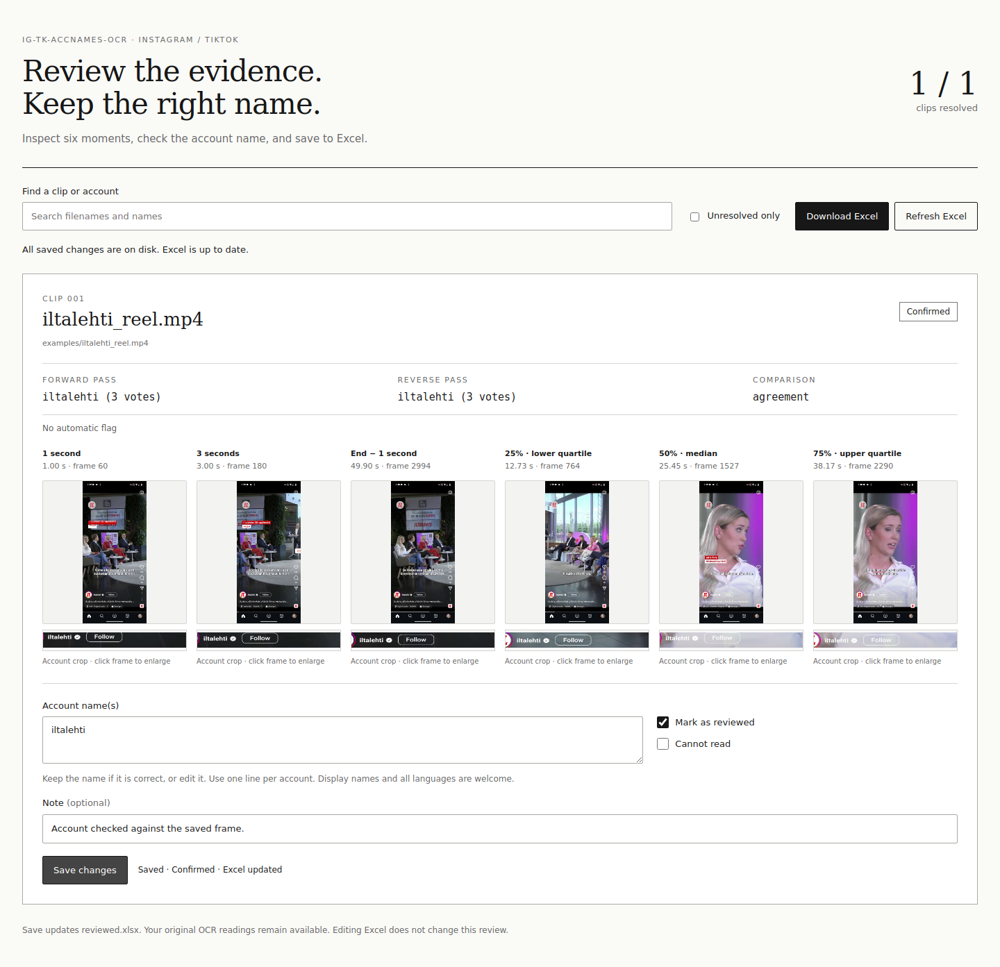
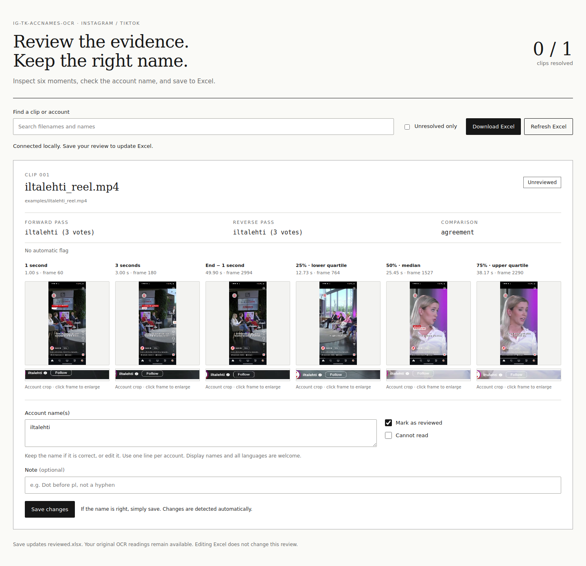
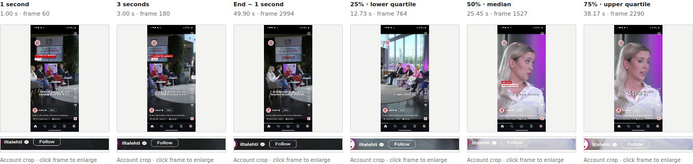
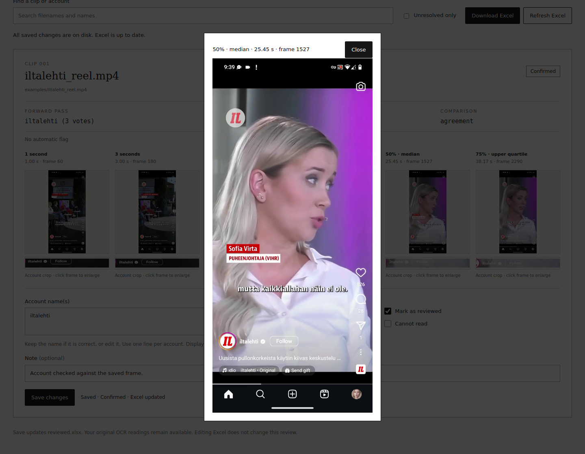
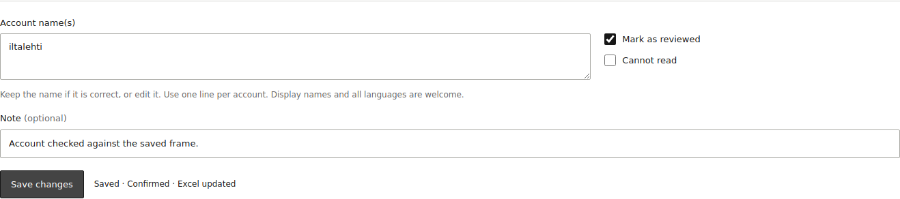
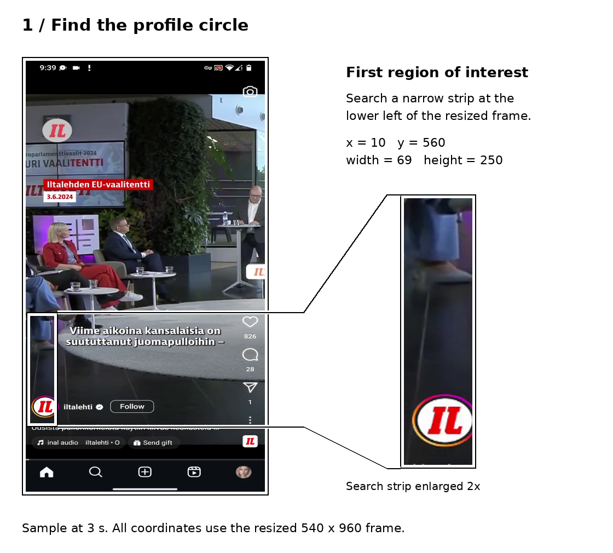
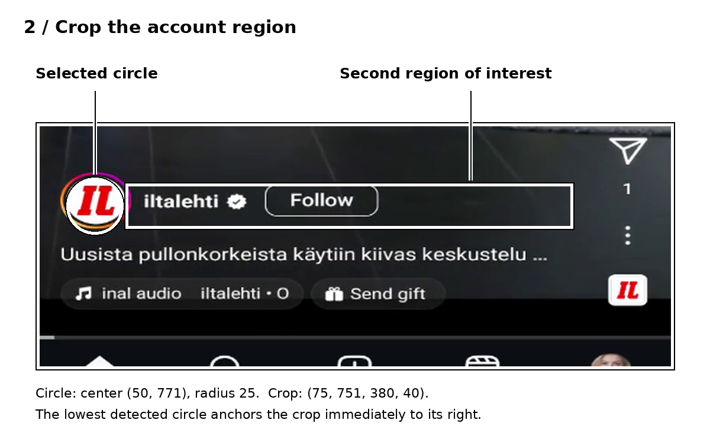
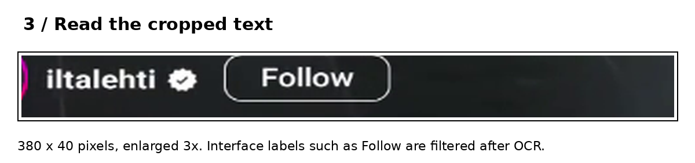
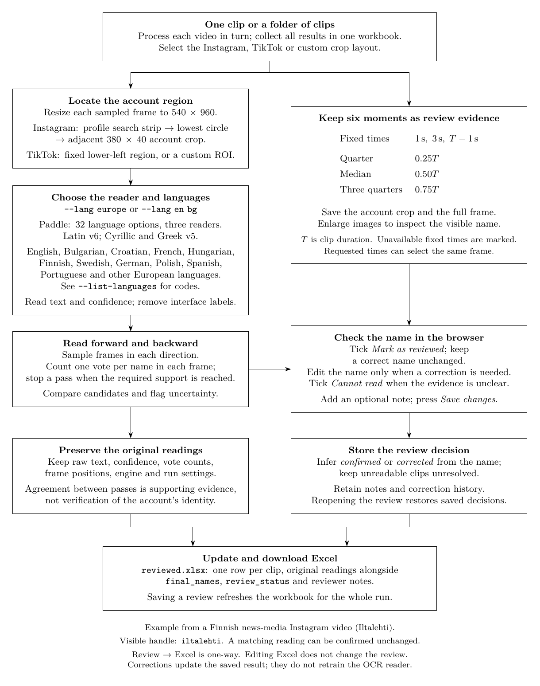

# IG-TK-AccNames-OCR

Extract account names from recorded Instagram Reels and TikTok clips, check the
frame evidence in your browser, and save reviewed results to Excel.

The package works with video files already on your computer. It finds the account
area, reads sampled frames in both directions, and keeps repeated candidates
alongside the original text. You make the final decision in a local review page.
No Instagram login or OCR API key is required.

**European language options:** Bulgarian, Croatian, French, Hungarian, Finnish,
Swedish, German, Polish, Spanish and Portuguese, plus English. Use
`--engine paddle --lang europe` for the broader **32-language/script preset**.



*Example from a Finnish news-media Instagram video (Iltalehti).*

[Quick start](#quick-start-on-fedora) · [Review and Excel](#review-and-excel) ·
[Languages](#languages-and-ocr-models) · [Process a folder](#process-a-folder) ·
[How the crop works](#how-the-account-crop-works) · [Troubleshooting](#troubleshooting) ·
[GitHub setup](docs/GITHUB_SETUP.md)

## What it does

- Processes one clip or a folder, with optional subfolder discovery.
- Offers EasyOCR and PaddleOCR, with explicit languages or a European preset
  covering Latin, Cyrillic and Greek model routes.
- Compares forward and backward readings and counts support across frames.
- Saves six review moments: **1 second, 3 seconds, 1 second before the end,
  25%, 50% and 75%** of the clip.
- Shows both the account crop and the full frame, with an enlarged view on click.
- Lets you confirm a correct reading without changing it, edit a name, or mark it
  unreadable using checkboxes.
- Updates one Excel workbook for the entire run, while retaining original OCR
  results and saved correction history.

An **account label** can be a handle such as `iltalehti` or a display
name such as `Новини България`. These are different things: OCR reads the visible
label; it does not look up the account or establish its identity. The review
accepts Unicode names, spaces and punctuation, including commas.

## Quick start on Fedora

Clone the GitHub repository and run the included sample:

```bash
sudo dnf install -y git python3.12
git clone https://github.com/econvaibhav/IG-TK-AccNames-OCR.git
cd IG-TK-AccNames-OCR
bash setup_laptop.sh --paddle
.venv/bin/python run_laptop_test.py --engine paddle --lang en fi
```

If you downloaded the project as a ZIP, extract it, open a terminal inside
`IG-TK-AccNames-OCR`, and start with `bash setup_laptop.sh --paddle`.
The installed package is `ig-tk-accnames-ocr` (version **0.4.0**), and its command
is `.venv/bin/ig-tk-accnames-ocr`.

The setup script creates `.venv`, installs the package and Excel support, and
installs CPU versions of the OCR dependencies. The first OCR run downloads model
weights into `models/`. Later runs reuse them. OCR inference and review run on
your computer.

The included `examples/iltalehti_reel.mp4` is a real **50.9-second Iltalehti Reel**
from a Finnish news-media account. The test
creates a new `results/laptop_...` folder and opens its review page. Keep the
terminal open while reviewing. If the browser does not open, use the
`http://127.0.0.1:.../` address printed in the terminal. Press **Ctrl+C** to stop the
server; saved reviews remain on disk.

To install and try only the existing EasyOCR option:

```bash
bash setup_laptop.sh
.venv/bin/python run_laptop_test.py --lang en
```

Python 3.12 on Linux CPU is the tested setup. The package declares Python 3.10 or
newer; other Python versions and operating systems depend on compatible OCR
wheels. You can choose another installed interpreter with
`OCR_PYTHON=python3.12 bash setup_laptop.sh --paddle`.

### Open a ready-made review

The repository includes the real sample's PaddleOCR output, so you can try the
review without running OCR or downloading model weights. After setup:

```bash
.venv/bin/ig-tk-accnames-ocr review examples/review_demo
```

The original reading is `iltalehti`. Inspect the frames, leave the name unchanged
and **Mark as reviewed** checked, then click **Save changes**. The page should
show **Confirmed**. Download Excel and check the `final_names`
column, or open `examples/review_demo/reviewed.xlsx` directly.

### Use your own clip

```bash
.venv/bin/python run_laptop_test.py \
  --engine paddle \
  --lang en de pl bg \
  --layout tiktok \
  --video "/path/to/your/clip.mp4"
```

Use `--layout reels` for Instagram Reels. The laptop test samples approximately
**2 frames per second**, stops a direction once a candidate receives **3 votes**,
and attempts at most **12 frames per direction**. These settings make it quick
to check installation and crops. They are not an accuracy guarantee.

Add `--no-review` to finish after writing the results, or `--no-open` to run the
review server without opening a browser automatically.

## Process a folder

This example processes the TikTok clips in the laptop folder used for testing,
including its subfolders. It enables ten European language groups plus
English; replace the language list with `--lang europe` for the broader preset:

```bash
OCR_RUN="results/tiktok_$(date +%Y%m%d_%H%M%S)"

OMP_NUM_THREADS=1 MKL_NUM_THREADS=4 \
.venv/bin/ig-tk-accnames-ocr run \
  "/home/vaibhavagarwal/Downloads/video_TK_clips" \
  --output "$OCR_RUN" \
  --recursive \
  --layout tiktok \
  --engine paddle \
  --lang en bg hr fr hu fi sv de pl es pt \
  --model-dir models \
  --sample-fps 2 \
  --min-votes 3 \
  --vote-margin 0 \
  --max-samples 12 \
  --screenshots \
  --excel

.venv/bin/ig-tk-accnames-ocr review "$OCR_RUN"
```

Run the final command in the same terminal so `$OCR_RUN` still points to that
run. Each run needs a **new output directory**; the package refuses to overwrite
an existing one.

Clips are processed one after another, with the OCR reader loaded once per job.
Filenames are sorted naturally, so `clip_2` precedes `clip_10`. A failed clip gets
an error row and processing continues. If you interrupt processing with Ctrl+C,
completed clips are exported.

**Twenty clips produce one review page and one workbook with twenty result rows.**
Saving a correction updates that clip's row in the shared `reviewed.xlsx`.

Supported extensions are `.mp4`, `.avi`, `.mov`, `.mkv`, `.flv`, `.wmv`, `.m4v`
and `.webm`; OpenCV must also be able to decode the particular file's codec.
For a folder of Reels, change the input path and use `--layout reels`.

## Review and Excel

1. Compare the candidate names with the account crops and full frames. Click a
   full-frame thumbnail to enlarge it.
2. Keep the name if it is correct, or edit it. Enter **one account per line**.
   Spaces and commas within a display name are preserved.
3. Leave **Mark as reviewed** checked and click **Save changes**. An unchanged
   reading is recorded as **Confirmed**; an edited reading becomes **Corrected**.
4. If the evidence is insufficient, select **Cannot read** and save. Add a note
   when it helps explain the issue.
5. Use **Download Excel** for the latest saved workbook. It is also written
   directly to the run folder as `reviewed.xlsx`.

There is no need to invent an edit just to confirm a correct name. Nonempty names
start with **Mark as reviewed** checked; the decision is only saved when you click
**Save changes**. Leaving both checkboxes unchecked saves a draft and keeps the
clip unresolved. The **Unresolved only** filter and search box help with larger
runs.

| Review status | Meaning | `final_names` | `needs_manual_review` |
| --- | --- | --- | --- |
| `unreviewed` | No completed review, or a saved draft | Original OCR candidates | `True` |
| `confirmed` | You accepted the original reading | Accepted names | `False` |
| `corrected` | You changed the reading and accepted it | Corrected names | `False` |
| `unreadable` | The account cannot be read reliably | Empty list | `True` |

**Use `final_names` together with `review_status` for analysis.** Names are stored
as a JSON list in the Excel cell, for example `["iltalehti"]`, so a
clip can retain more than one account. Draft edits are saved in the review state
but do not replace the original candidates in `final_names` until accepted.

The workbook also includes notes, the last review timestamp, a revision number,
original OCR fields, and the 3-second crop when available. Its header is frozen
and filtering is enabled. Original `status` and `needs_review` describe the
automatic OCR result; they remain unchanged after a human correction.

Saved corrections go **from the review page to Excel**. Editing the workbook
does not update the review, and corrections do not train or change the OCR model.
If Excel or LibreOffice locks the file, close it and click **Refresh Excel**.
The correction is saved before the workbook is refreshed, so an export error does
not discard it.

### See the review steps

These screenshots use the real `examples/iltalehti_reel.mp4` supplied with the
project. They illustrate that sample's review, not a multilingual EU benchmark.

**Before review.** The original PaddleOCR reading is `iltalehti`. The two
passes agree; inspect the frame evidence to confirm the visible account name.



**Six moments from the same clip.** Existing fixed times and the three time
quartiles provide crops and full-frame context together.



**Inspect the full frame.** Click a thumbnail to enlarge the original frame when
the small account crop is ambiguous or appears misplaced.



**Confirm the reading.** The close-up shows the unchanged `iltalehti` name,
review checkboxes and saved status. The workbook is refreshed from the same
saved review state.



The complete saved review is shown in the screenshot at the top of this README.

### Reopen an existing run or upgrade the interface

Stop an old review server with Ctrl+C. From the updated project folder, open the
existing results using its full path:

```bash
.venv/bin/ig-tk-accnames-ocr review \
  "/path/to/previous/results/tiktok_YOUR_RUN_FOLDER"
```

This regenerates the interface using the installed code and reloads saved
`review_state.json` decisions. **You do not need to repeat OCR for a review UI
update.** Keep the entire run folder, including its screenshots, together when
moving it. Opening `review.html` directly gives a preview; saving requires the
local server command above.

When updating the package itself, extract or clone the new version into its own
folder and run setup there. Existing result folders can stay where they are.
To recover text with a different language model or crop, process the original
video again into a new output folder.

## Languages and OCR models

Use `--lang` followed by the languages you expect. The default remains `en pl`.
Language selection works with `run_laptop_test.py`, `run` and `batch`.

Common European country/language selections, plus English:

| Country or context | Language | Code |
| --- | --- | --- |
| Across datasets | English | `en` |
| Bulgaria | Bulgarian | `bg` |
| Croatia | Croatian | `hr` |
| France | French | `fr` |
| Hungary | Hungarian | `hu` |
| Finland | Finnish | `fi` |
| Sweden | Swedish | `sv` |
| Germany | German | `de` |
| Poland | Polish | `pl` |
| Spain | Spanish | `es` |
| Portugal | Portuguese | `pt` |

These are language selections, not country filters. For example, a clip recorded
in Finland can contain an English or Swedish account name. Select the languages
that may appear in the visible account labels.

To try all ten groups plus English on one clip:

```bash
.venv/bin/python run_laptop_test.py \
  --video "/path/to/your/clip.mp4" \
  --layout tiktok --engine paddle \
  --lang en bg hr fr hu fi sv de pl es pt
```

That combination uses **two script recognizers**, not eleven separate models:
PP-OCRv6 small for the Latin-script languages and the PP-OCRv5 mobile Cyrillic
recognizer for Bulgarian. Both can also read English.

### European presets

Use `--lang europe` as a convenient broader preset:

```bash
.venv/bin/python run_laptop_test.py \
  --video "/path/to/your/clip.mp4" \
  --layout tiktok --engine paddle --lang europe
```

The preset expands to these 32 language/script codes:

```text
en bg hr fr hu fi sv de pl es pt el it nl da no cs sk sl ro et lv lt ga mt is uk ru rs_latin rs_cyrillic sq tr
```

It includes codes for the 24 official EU languages plus Norwegian, Icelandic,
Ukrainian, Russian, Serbian in Latin and Cyrillic, Albanian and Turkish. It selects
**three script recognizers**: Latin, Cyrillic and Greek. This is an OCR model
selection shortcut; it does not translate names, identify countries or infer
which languages are present in an individual clip.

For a collection known to use Latin-script labels, `--lang europe-latin` removes
`bg`, `el`, `uk`, `ru` and `rs_cyrillic` from that preset. It uses one PP-OCRv6
recognizer and is a lighter option. Use the full `europe` preset when Bulgarian
or other Cyrillic and Greek labels may occur.

Other languages in these presets include:

| Language | Code | Language | Code |
| --- | --- | --- | --- |
| Greek | `el` | Italian | `it` |
| Dutch | `nl` | Danish | `da` |
| Norwegian | `no` | Czech | `cs` |
| Slovak | `sk` | Slovenian | `sl` |
| Romanian | `ro` | Estonian | `et` |
| Latvian | `lv` | Lithuanian | `lt` |
| Irish | `ga` | Maltese | `mt` |
| Icelandic | `is` | Ukrainian | `uk` |
| Russian | `ru` | Serbian, Latin | `rs_latin` |
| Serbian, Cyrillic | `rs_cyrillic` | Albanian | `sq` |
| Turkish | `tr` | | |

To print the supported codes and presets without processing a video or loading
models:

```bash
.venv/bin/ig-tk-accnames-ocr --list-languages
```

The same flag also works after `run` or `batch`, and with
`.venv/bin/python run_laptop_test.py --list-languages`.

### How model selection works

The Paddle adapter selects recognizers by the requested scripts. Adding a
language code to a recognizer that cannot output that script would not recover
the missing text; the adapter therefore loads the appropriate model explicitly.

| Requested languages | Recognition model(s) used |
| --- | --- |
| `en`, `en de pl`, or `europe-latin` | `PP-OCRv6_small_rec` |
| `en bg` | `cyrillic_PP-OCRv5_mobile_rec`, which also reads English |
| `en bg hr fr hu fi sv de pl es pt` | PP-OCRv6 small **and** the Cyrillic PP-OCRv5 mobile recognizer |
| `en el` | `el_PP-OCRv5_mobile_rec`, which also reads English |
| `europe` | PP-OCRv6 small, Cyrillic PP-OCRv5 mobile and Greek PP-OCRv5 mobile |

All Paddle routes use the PP-OCRv6 detector. `--paddle-size tiny` or `medium`
changes the v6 detector and any v6 recognizer; the specialized v5 recognizers
stay mobile. **Small** is the tested laptop preset.

### Performance and mixed-script readings

The eleven-language example runs each crop through two model
pipelines; `europe` runs it through three. Detection is included in each pipeline,
so this costs more time and memory than one script group. Adding more languages
within the same script group does not create one model per language.

Identical overlapping readings are combined; different readings are kept for
review. A label still receives at most one vote per sampled frame, even when two
models read it. Requested languages, expanded language codes and actual model
names are recorded in `run.json`. Model sources accompany raw observations in
`details.jsonl`.

EasyOCR remains available with `--engine easyocr`, for combinations such as
`--lang en pl` or `--lang en bg`. EasyOCR 1.7.2 does not list Finnish or Greek, and
it cannot load every script combination together. Both European presets therefore
require **`--engine paddle`**, including the Latin preset because it contains
Finnish. An incompatible EasyOCR request reports the problem; it does not silently
switch engines. `--list-languages` shows per-language engine support, and
unsupported codes produce an explicit error.

The listed languages describe configured model support. Recognition quality
still depends on the crop, resolution, font, motion and visible text; these
examples do not establish accuracy across an EU clip collection.

### When a Bulgarian clip returns no text

Use the new Cyrillic route and rerun that clip. The recognizer was checked with
the synthetic text `Новини България`, which it read successfully. This confirms
that the route can emit Bulgarian text; the particular Bulgarian video still
needs to be tested.

Also inspect the **crop**. A recognizer cannot read an account that lies outside
its input image. TikTok's visible account field may contain a display name with
spaces, and the TikTok candidate filter preserves those. If the name is absent
from the crop, adjust `--roi` while keeping `--layout tiktok`.

## How the account crop works

Every frame is resized to a **540 × 960** working image. Crop coordinates below
refer to that resized image, not the original video resolution.

### 1. Find the profile-circle area

For Reels, the first region of interest (ROI) is a narrow strip on the lower
left: `(x=10, y=560, width=69, height=250)`. The code searches for circular
profile images inside it and selects the lowest detected circle.



### 2. Crop the adjoining account text

The second ROI starts beside the selected circle and measures **380 × 40**
working pixels. Bounds checks keep it inside the image. In the sample's
3-second frame, this produces `(x=75, y=751, width=380, height=40)`.



### 3. Read the crop and retain the evidence



OCR reads this crop. Candidate filtering removes common interface text such as
`Follow` and `Following`, while preserving uncertain readings for review. If no
profile circle is found, that sampled frame supplies no OCR crop; the review
still keeps the full frame where it can be decoded.

TikTok uses a fixed lower-left crop, initially
`(x=0, y=650, width=270, height=230)`. **The TikTok layout is experimental**, so
TikTok results are flagged for review. It does not use the Reels circle detector.

### Adjust a crop

Use `--roi x,y,width,height` with `--layout tiktok` or `--layout fixed`:

```bash
.venv/bin/python run_laptop_test.py \
  --video "/path/to/tiktok_clip.mp4" \
  --engine paddle --lang en de pl bg \
  --layout tiktok --roi 0,600,440,280
```

This is an example wider crop, not a universal TikTok setting. Choose coordinates
that include the account without unnecessarily including captions or comments.
Use `--layout fixed --roi ...` for a fixed Instagram crop; fixed mode retains
Instagram-style candidate filtering. For the Reels circle-search strip, the main
CLI also accepts `--circle-roi x,y,width,height`.

## Sampling, votes and frame evidence



For each clip, the pipeline:

1. Samples frames from the beginning and reads the account crop.
2. Counts each candidate once per frame and stops when the leading candidate
   reaches the vote threshold, or the sample limit/end is reached.
3. Repeats from the end of the clip toward the beginning.
4. Compares the leading candidates from both directions.
5. Saves independent review frames at the six requested time points.

`agreement` means the retained readings match across the two passes. `similar`
means their text is similar enough for pairing; `disagreement` leaves unmatched
candidates. `one_sided` and `no_text` indicate a reading in only one direction or
neither. Multiple candidates, low support and decoding failures also trigger
review flags. **Agreement measures repeatability, not whether the account is
correct.**

The 25%, 50% and 75% frames are **time quartiles**. They are not confidence
percentiles or extra OCR votes. Fixed times outside a short clip are shown as
unavailable; nearby requested times can resolve to the same frame. Frame timing
uses the video FPS and frame count, so it assumes constant-frame-rate timing.
Full-frame images retain the original video dimensions; OCR crops use the working
resolution.

### Adjust processing depth

| Option | Main CLI default | Effect |
| --- | --- | --- |
| `--sample-fps` | `20` | Approximate sampling rate per direction; cannot exceed available frames. |
| `--min-votes` | `11` | Stop a direction when a candidate reaches this many supporting frames. |
| `--vote-margin` | `3` | Retain candidates within this many votes of the leader. |
| `--max-samples` | `0` | Limit attempted frames per direction; `0` means no sample cap. |
| `--min-confidence` | `0` | Discard detections below this OCR confidence. |
| `--similarity` | `0.8` | Threshold for pairing candidate text between directions. |
| `--min-duration` | `0` | Skip clips shorter than this many seconds. |

The folder example uses the faster laptop settings explicitly. For a more
thorough pass, remove those four sampling/voting overrides to use the main CLI
defaults. More sampled frames can help with transient overlays or motion, but
cannot repair an incorrect crop or unsupported script.

## Files in a run

| File or folder | Purpose |
| --- | --- |
| `results.xlsx` | Original OCR workbook, created with `--excel`. |
| `reviewed.xlsx` | Current saved review, one row per clip, refreshed when opening or saving the review. |
| `review_state.json` | Saved decisions, names, notes and correction history; created on the first save. |
| `details.jsonl` | Original results and raw frame observations: text, confidence, candidates, model sources and crop coordinates. |
| `run.json` | Input, settings, model names and installed package versions. |
| `screenshots/` | Account crops and full frames for the six review moments where available. |
| `review.html`, `review.css`, `review.js` | The generated local review interface. |
| `results.csv` | Original machine-readable export, retained for script compatibility. |

Excel is the review interface's only download format. The review no longer
creates a `reviewed.csv` file; an old one from a previous version is not refreshed.
The original OCR outputs are not overwritten by manual review.

## Checks and examples

On the included sample, the checked CPU runs produced:

| Engine | Forward reading | Reverse reading | Visible label |
| --- | --- | --- | --- |
| EasyOCR 1.7.2 (`en`) | `iltalehti` · 3 votes | `iltalehti` · 3 votes | `iltalehti` |
| PP-OCRv6 small (`en fi`) | `iltalehti` · 3 votes | `iltalehti` · 3 votes | `iltalehti` |

Both runs report agreement with no automatic review flags. This is one worked
example, not an accuracy benchmark; the review still lets you check and confirm
the reading against the frames.

The `europe` preset also passed a CPU integration check with all three actual
recognizers: synthetic `Новини България` (Bulgarian), `Νέα Ευρώπη` (Greek) and
`głos.polski` (Polish) were read correctly by their corresponding models.
Conflicting readings from other script models remained available for review.
This checks model selection and inference together; it does not measure accuracy
for all 32 language/script selections. The automated suite currently has
**37 passing tests**.

Run the automated checks after setup:

```bash
.venv/bin/python -m unittest discover -s tests -v
.venv/bin/python -m pip check
```

The tests cover sampling and voting, language routing, mixed-model duplicate
readings, saved corrections and reopening, unchanged Unicode/display names,
draft and unreadable decisions, Excel failures, stale review revisions, and
short-clip frame bounds. Model weights are not required for these unit tests.
GitHub Actions runs the same tests on Python 3.10 and 3.12 and builds a wheel.
The supplied Paddle adapter was checked with PaddleOCR 3.7.0 and PaddlePaddle
3.3.1 on Linux CPU; MKL-DNN is disabled because its accelerated path failed on
the test runtime. GPU Paddle inference is not enabled by this setup.

## Troubleshooting

| What you see | What to do |
| --- | --- |
| A correct name previously failed handle validation | Run the updated review command on the existing results folder. Unicode display names, spaces and punctuation are now accepted. Leave Mark as reviewed checked and save. |
| Bulgarian text returns no candidates | Use `--engine paddle --lang en bg`, or add `bg` to a mixed-language run, and process the original clip again. Inspect the account crop too. |
| The account is outside the crop | Adjust the TikTok/fixed `--roi` or Reels `--circle-roi`, then rerun into a new output folder. |
| A Reels file is marked `skipped_layout` | The filename guard treats names containing `video` but not `reel` as possible feed posts. For a known Reel, give the file a name containing `reel`; otherwise use an appropriate fixed crop. |
| Save is unavailable when opening HTML | Start `.venv/bin/ig-tk-accnames-ocr review <run folder>`; direct HTML opening is preview-only. |
| Excel cannot be refreshed | Close the workbook, then click Refresh Excel. Saved corrections remain in `review_state.json`. |
| The review changed in another tab | Reload to see the latest saved revision before making another change. |
| A review server already has the folder open | Use its existing browser tab, or stop that server before opening another. |
| Output already exists | Choose a new output directory for each OCR run. Reopening a review uses its existing directory. |
| Model downloads are unavailable | Download once with the chosen model/languages, then reuse the same cache with `--offline --model-dir models`. |

To see all options:

```bash
.venv/bin/ig-tk-accnames-ocr --help
.venv/bin/ig-tk-accnames-ocr run --help
.venv/bin/ig-tk-accnames-ocr review --help
```

## GitHub setup

The repository is named **IG-TK-AccNames-OCR**. The detailed
[GitHub setup guide](docs/GITHUB_SETUP.md) covers creating or connecting the
repository and uploading the prepared project. For normal use, clone it with the
quick-start command above and keep using the same package command after setup.

## Repository guide

| Location | Contents |
| --- | --- |
| `instagram_ocr/core.py` | Configuration, candidate filtering, votes and comparisons. |
| `instagram_ocr/vision.py` | Video access, crops and reader selection. |
| `instagram_ocr/engines.py` | Paddle models and normalized detections. |
| `instagram_ocr/languages.py` | Language codes, aliases, European presets and engine compatibility checks. |
| `instagram_ocr/pipeline.py` | Forward/reverse scans and review frames. |
| `instagram_ocr/files.py` | Video discovery, manifests and original tabular results. |
| `instagram_ocr/review.py` | Local server, durable review state and Excel refresh. |
| `instagram_ocr/review_page.py`, `instagram_ocr/static/` | Review HTML, CSS and browser behaviour. |
| `instagram_ocr/excel.py` | Workbook formatting and embedded frame crops. |
| `examples/` | The real sample clip and a ready-made review. |
| `tests/` | Automated checks. |
| `visuals/` | LaTeX diagram, rendered figures and crop examples. |
| `legacy/` | Nine original scripts retained as references; use the package for current runs. |
| `docs/GITHUB_SETUP.md` | Step-by-step GitHub repository setup and upload instructions. |

The internal Python module remains `instagram_ocr` for compatibility with earlier
imports and `python -m instagram_ocr` commands. The current project, installed
package and CLI names are **IG-TK-AccNames-OCR**, `ig-tk-accnames-ocr` and
`ig-tk-accnames-ocr`, respectively.

The `legacy` scripts contain their original fixed paths, dependencies and run
settings. Their individual roles are described in [legacy/README.md](legacy/README.md).

### Folder manifests and array jobs

The package can create one task per video folder for a Slurm array. First write a
manifest:

```bash
.venv/bin/ig-tk-accnames-ocr manifest "/path/to/video/root" \
  --output manifests/folders.json
```

Then process one listed folder, using one-based task IDs:

```bash
.venv/bin/ig-tk-accnames-ocr batch manifests/folders.json \
  --task-id 1 --output results/array_run \
  --layout tiktok --engine paddle --lang en de pl bg \
  --model-dir models --screenshots --excel
```

Without `--task-id`, the command reads `SLURM_ARRAY_TASK_ID`. Each task writes to
its own `task_00001`, `task_00002`, and so on, with its own workbook. A single
recursive `run` is the simpler option when you want one combined laptop review.

`--layout auto` infers platforms only from directory components named exactly
`instagram` or `tiktok`, ignoring case. It does not infer them from abbreviations
such as `video_TK_clips`; use an explicit layout for those folders.

### Rebuild the figures

The LaTeX source, PDF and PNG are included. LaTeX is not needed to run OCR.
Open [visuals/OCR_Workflow.tex](visuals/OCR_Workflow.tex) in Overleaf, or compile
locally with TikZ and the `standalone` document class installed:

```bash
pdflatex -interaction=nonstopmode -halt-on-error \
  -output-directory visuals visuals/OCR_Workflow.tex
.venv/bin/python visuals/render_rois.py
```

The second command recreates the crop illustrations from the sample video.
The review screenshot shows the actual local interface.

## References

- [PaddleOCR source and releases](https://github.com/PaddlePaddle/PaddleOCR)
- [PaddleOCR pipeline and Python API](https://github.com/PaddlePaddle/PaddleOCR/blob/main/docs/version3.x/pipeline_usage/OCR.en.md)
- [PaddleOCR text recognition models](https://paddlepaddle.github.io/PaddleOCR/main/en/version3.x/module_usage/text_recognition.html)
- [PaddleOCR multilingual models, including Bulgarian](https://github.com/PaddlePaddle/PaddleOCR/blob/main/docs/version3.x/algorithm/PP-OCRv5/PP-OCRv5_multi_languages.en.md)
- [EasyOCR documentation and languages](https://www.jaided.ai/easyocr/documentation/)
- [PyTorch installation](https://pytorch.org/get-started/locally/)
